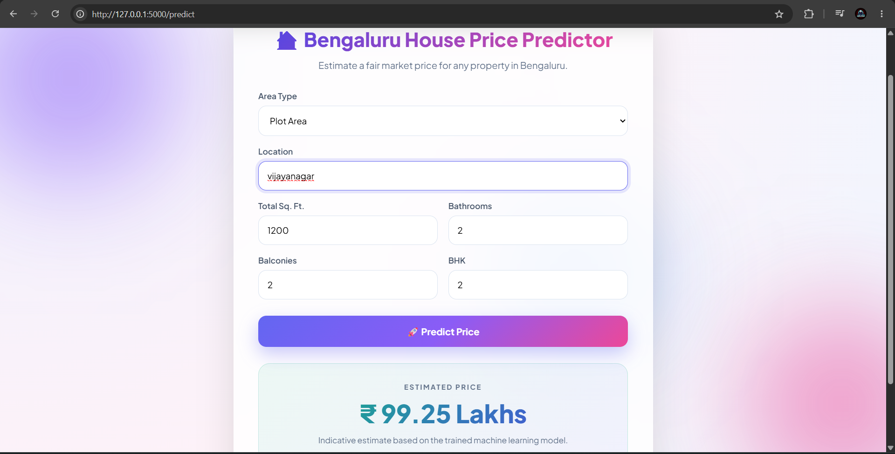
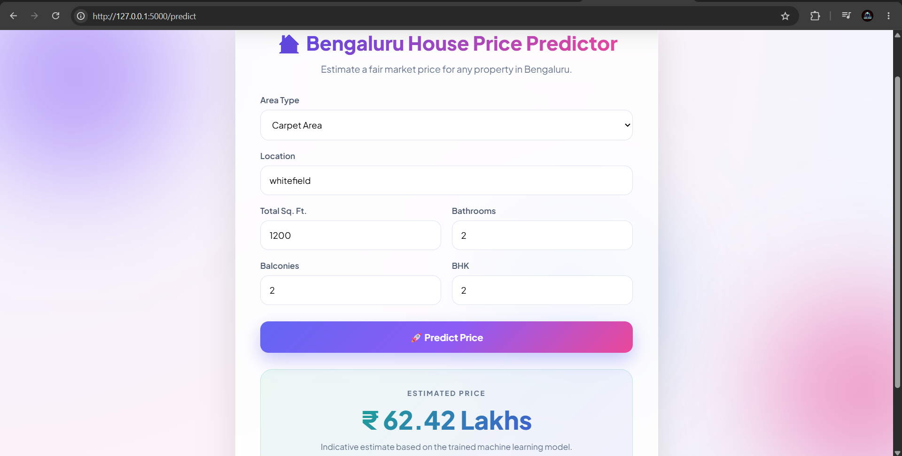

# 🏠 Bengaluru House Price Prediction


A Machine Learning web application that predicts **Bengaluru house prices** based on user inputs such as location, area type, total square feet, number of bathrooms, balconies, and BHK.

---

## 🚀 Features

- Predicts Bengaluru house prices using Machine Learning
- Clean and responsive web interface
- Data preprocessing and feature engineering
- One-hot encoding for categorical features
- Model trained using Linear Regression
- Flask backend for real-time predictions
- Input validation and error handling

---

## 🛠️ Tech Stack

- Python
- Flask
- Scikit-learn
- Pandas
- NumPy
- HTML5
- CSS3

---

## 📊 Machine Learning Workflow

1. Data Cleaning
2. Feature Engineering
3. Outlier Removal
4. One-Hot Encoding
5. Model Training
6. Model Evaluation
7. Model Deployment using Flask

---

## 📈 Model Performance

| Metric | Value |
|---------|-------|
| R² Score | 0.77 |
| MAE | 18.9 |
| RMSE | 42 |

---

## 📁 Project Structure

```
House-Price-Prediction
│
├── dataset/
├── model/
│   ├── house_price_model.pkl
│   └── columns.json
├── static/
├── templates/
├── app.py
├── predict.py
├── train_model.py
├── compare_models.py
├── feature_importance.py
├── requirements.txt
└── README.md
```

---

## 📷 Screenshots

<h2>example</h2>



<h2>example</h2>



---

## ⚙️ Installation

Clone the repository

```bash
git clone https://github.com/adarshk-ops/House-Price-Prediction.git
```

Move into the project

```bash
cd House-Price-Prediction
```

Create virtual environment

```bash
python -m venv venv
```

Activate virtual environment

Windows

```bash
venv\Scripts\activate
```

Install dependencies

```bash
pip install -r requirements.txt
```

Run the application

```bash
python app.py
```

Open your browser

```
http://127.0.0.1:5000
```

---

## 🔮 Future Improvements

- Add Searchable Location Dropdown
- Try XGBoost and CatBoost
- Deploy on Render
- Interactive charts and analytics
- User authentication
- Price range estimation

---

## 👨‍💻 Author

**Adarsh K**

GitHub: https://github.com/adarshk-ops

---

⭐ If you found this project useful, consider giving it a star.
